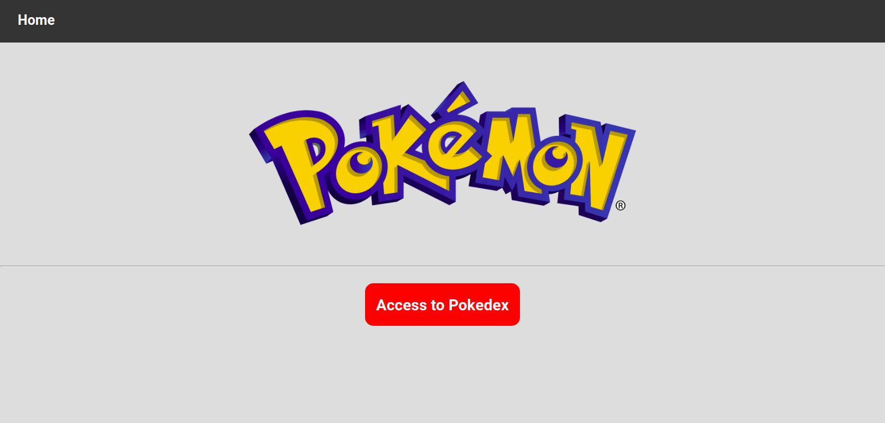
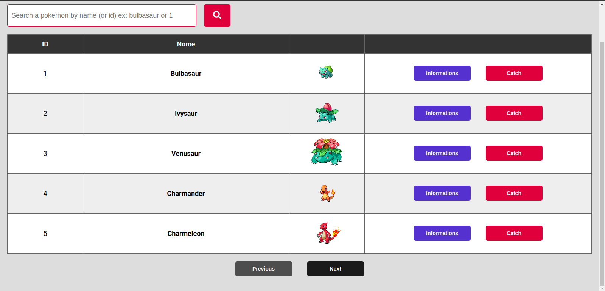
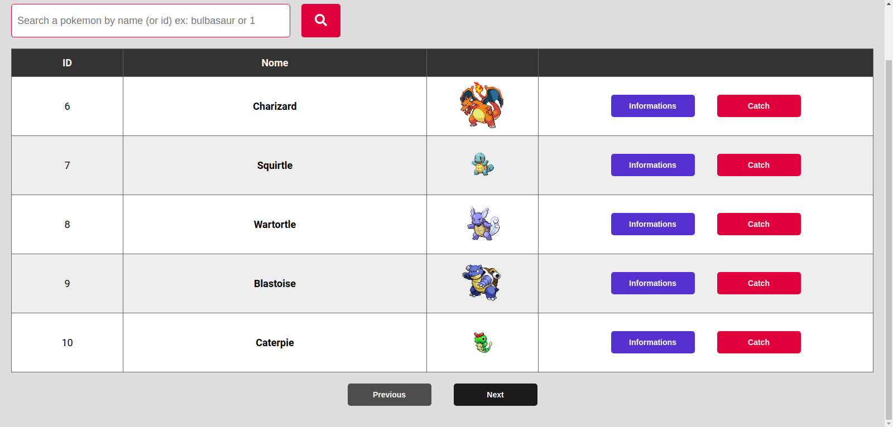
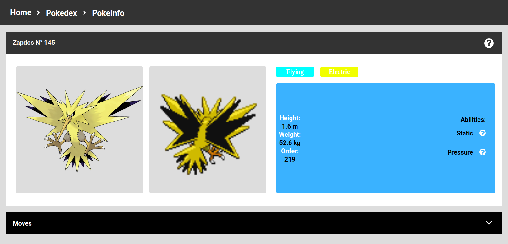
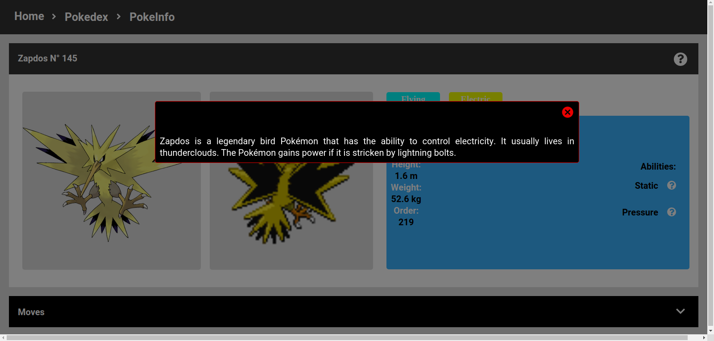
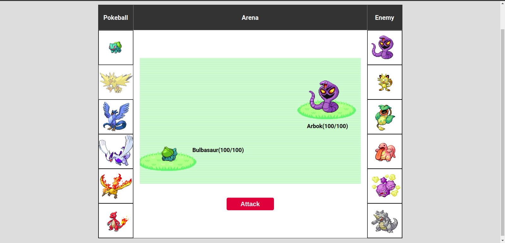

    

 

### 💡 Project

This is an app just made for practice, using the [PokeApi v2](https://github.com/PokeAPI/pokeapi/tree/master/pokemon_v2)

| Tela Inicial  | Pokedex   |   
|---------------|-----------| 
 | 

| Pokedex(paginada)  | Pokemon (infos)   |   
|--------------------|-------------------| 
 | 

| Pokemon(descrição)  | Batalha     |   
|---------------------|-------------| 
 | 

### 📱 Techs
- ReactJS
- Axios
- node-sass

### 🔨 How to run
- Clone this repository && cd;
- `yarn` to install dependencies.
- `yarn start` to run app.

### 📈 How to contribute?
- Fork this repository;
- Create a branch with you feature: `git checkout -b my-feature`
- Commit changes: `git commit -m 'feat: My new feature'`
- Push branch: `git push origin my-feature`

### 🛬 Routes
- Coming soon

### Images HD
- To put images in HD, mkdir src/images and paste all images inside.

### 📝 License
MIT license. See license on [LICENSE](LICENSE) 

